# Creating and Distributing Tiled Maps

## Taro Matsuzawa
### Geolonia Inc.

---

# Notes

- This presentation uses some command-line tools.
  - Open the following link in your browser.
  - Copy and paste the commands into your terminal.

https://smellman.github.io/jica_2026/

---

# Self-introduction

- GIS Engineer at Geolonia Inc.
  - Programming: Python, JavaScript, TypeScript, Ruby, etc.
  - UNIX and Linux guru
  - GIS skills: Data processing, Tiled maps
- Community
  - Director of [OSGeo.JP](https://www.osgeo.jp/)
  - Director of [OpenStreetMap Foundation Japan](https://www.osmf.jp/)
  - Vice President of [Japan Unix Society](https://www.jus.or.jp/)
  - [UNOpenGIS/7](https://github.com/UNopenGIS/7) volunteer
- Contact: taro.matsuzawa@geolonia.com / @smellman on X

---

# Today's agenda

- System setup
- What is a tiled map?
- Software and data used in this presentation
- How to create your own tiled map
- How to design your own tiled map
- How to distribute your own tiled map

---

# System setup

- This presentation requires a Linux-based OS.
  - We use a Raspberry Pi 4 in this seminar.

---

# System setup - Connect your device

https://hackmd.io/@smartmaps/26

- Connect to SSID "vectortiles"
- Launch your terminal application (PowerShell).
- Connect to your device via SSH.

```Powershell
ssh niroku@<your ip>
```

---

# System setup - Prepare your device

`niroku` is the installer for this seminar.

https://github.com/unvt/niroku

```bash
wget -qO- https://unvt.github.io/niroku/install.sh | sudo -E bash -
```

---

# System setup - Clone the seminar repository

```bash
git clone https://github.com/smellman/jica_scripts.git
cd jica_scripts/system
sudo make
```

---

# What is a tiled map?

---

# Tile technology

- Provides map images or data over the Internet.
  - Map images are divided into tiles.
  - Zoom level 0 = the whole world
  - Each zoom level doubles the width and height.
  - Most tiles use the "Web Mercator" projection.

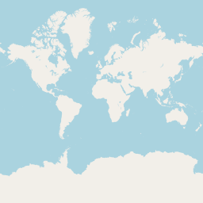
https://a.tile.openstreetmap.org/0/0/0.png

---

# Well suited to the web

- The tile structure is well suited to the web.
  - Enables smooth map scrolling.
  - Enables smooth zooming in and out.
  - Uses simple HTTP GET requests.
- Tiles became widely known through Google Maps.
  - Tiles have existed since the late 1990s.

---

# Zoom

- Zoom level 0 : 1 file
- Zoom level 1 : 2 x 2 = 4 files
- Zoom level 2 : 4 x 4 = 16 files
- ...
- Zoom level 18 : 2^18 x 2^18 = 262,144 x 262,144 = 68,719,476,736 files


https://maps.gsi.go.jp/help/image/tileNum.png

---

# GET Request

- Many services use a REST API (GET requests).
  - https://.../Z/X/Y.Format
  - Z: Zoom Level
  - X: X coordinate
  - Y: Y coordinate
  - Format: 
    - Raster image formats (png, jpg, webp)
    - Vector data formats (pbf, mvt)

---

# GET Request example

- https://a.tile.openstreetmap.org/3/2/4.png
  - Zoom = 3, X = 2, Y = 4, format = png
  - X and Y coordinates start with 0.

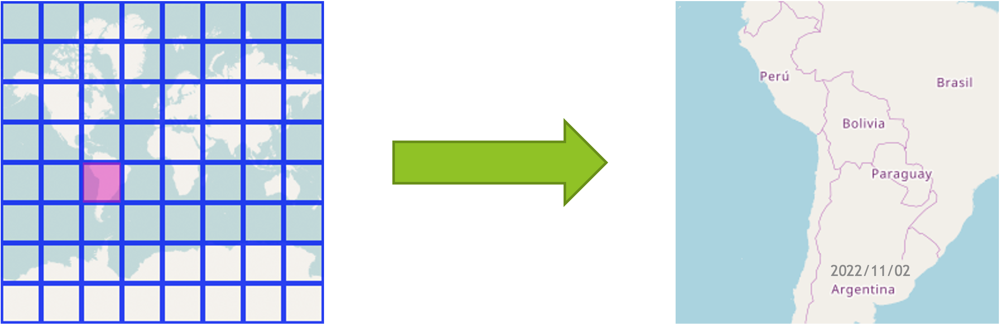

---

# Specification

- Two tile service specifications are popular.
  - Tile Map Service (TMS)
  - Web Map Tile Service (WMTS)
- TMS is simpler than WMTS.
- TMS X/Y coordinates start from the bottom left.
  - Same as the Cartesian coordinate system.
- WMTS X/Y coordinates start from the top left.
  - Same as the coordinate system of 2D computer graphics.

---

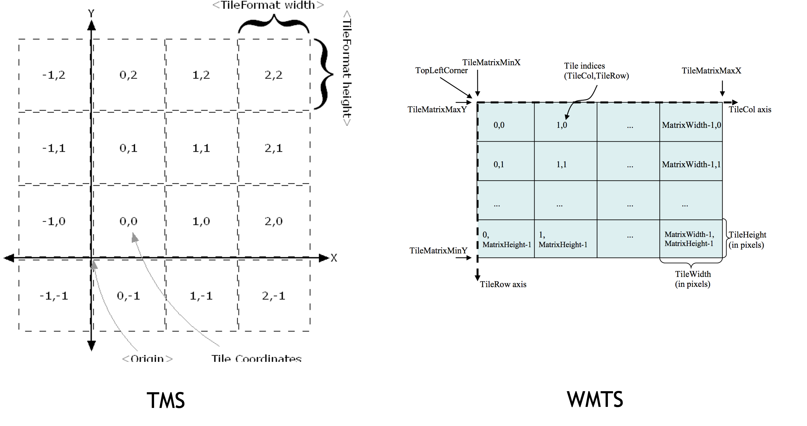

---

# The flipped Y coordinate

- OpenStreetMap uses a TMS-like protocol, but the Y coordinate is numbered from the top.
  - OpenStreetMap calls this a "Slippy Map".
  - We call it an XYZ tile.
    - {z}/{x}/{y}.png
    - Also called a ZXY tile.


https://maps.gsi.go.jp/help/image/tileNum.png

---

# XYZ tile

- The de facto standard for tiled maps.
  - Web Mercator projection
  - TMS with a flipped Y coordinate
  - Provides a REST API
    - {z}/{x}/{y}.{format}
  - No one publishes a formal "specification".
- Many libraries support XYZ tiles.
  - Leaflet, OpenLayers, MapLibre GL JS, Google Maps API, etc.

---

# Raster tile (1/3)

- Provides "rendered images"
  - The image doesn't contain any "data".
  - Focuses on visualization.

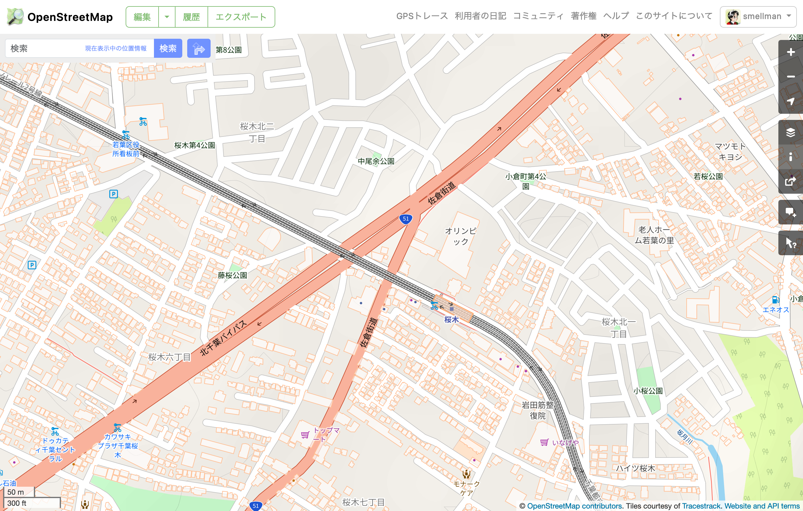

---

# Raster tile (2/3)

- Provides "satellite images" or "aerial photographs"
  - Focuses on photography.
  - These images don't contain any "data" either.

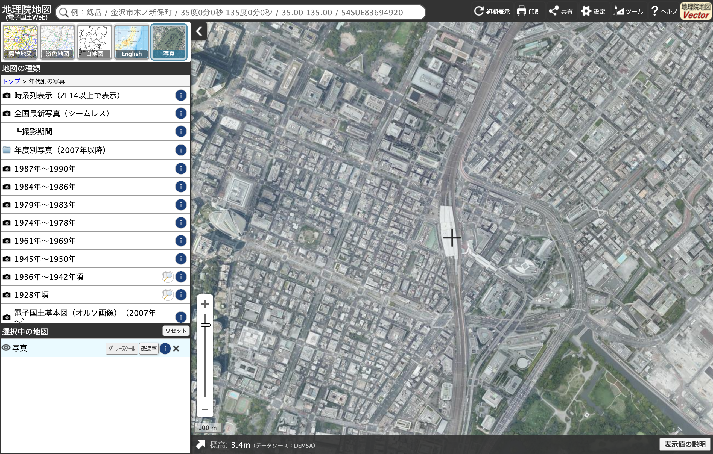

---

# Raster tile (3/3)

- Provides "data" as images.
  - Focuses on data.
    - Population, temperature, rainfall, elevation, etc.
  - The image encodes "data" as colors.
    - In this example, elevation values can be calculated from the RGB values.

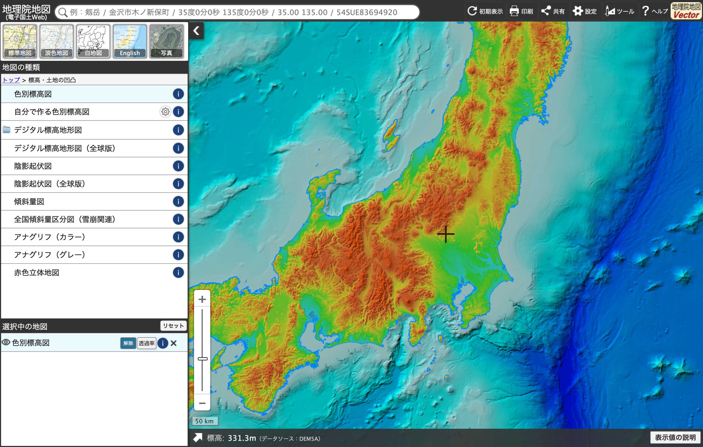

---

# Vector tile (1/2)

- Provides "vector data"
  - Each tile contains "vector data".
    - A tile works like a data container.

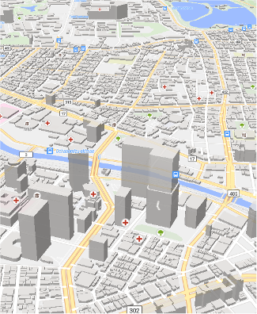

---

# Vector tile (2/2)

- Vector tiles don't have a style.
  - The client renders images based on style settings.
    - Easy to rotate and tilt the map.
    - Supports 3D rendering.
- Programmable
  - The client can change the style dynamically.
  - Interactive demo:
    - https://smellman.github.io/osm-sound-demo/

---

# Vector tile example - Multilingual

- https://openmaptiles.org/languages/
  - The main language can be changed dynamically.

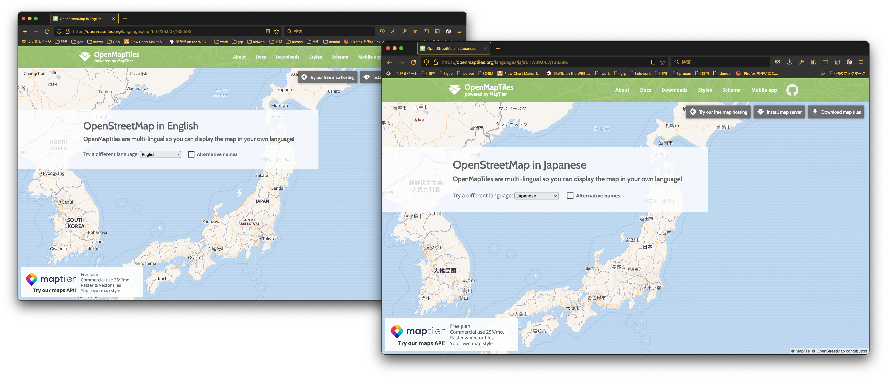

---

# Vector tile example - Geospatial Information Authority of Japan

- https://maps.gsi.go.jp/vector/
  - GSI provides vector tiles.
  - The style can be changed dynamically.

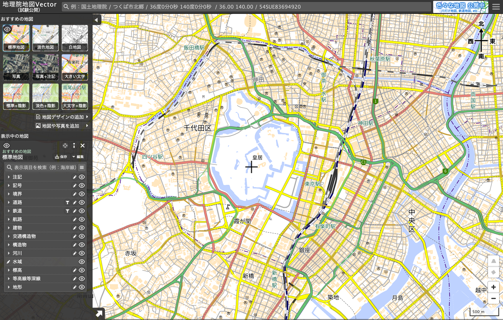

---

# Mapbox Vector Tile

- The de facto standard for vector tiles.
  - Vector tile specification by Mapbox Inc.
- Specification
  - Tiles are encoded in Protocol Buffers format.
  - Designed for the Web Mercator projection.
  - Supports layers and features.

https://docs.mapbox.com/data/tilesets/guides/vector-tiles-standards/

---

# Mapbox GL ecosystem and Style Specification

- Mapbox provides Mapbox GL JS (Web) and Mapbox GL Native (smartphone and desktop applications).
  - Mapbox also provides a styling specification.
https://docs.mapbox.com/style-spec/guides/

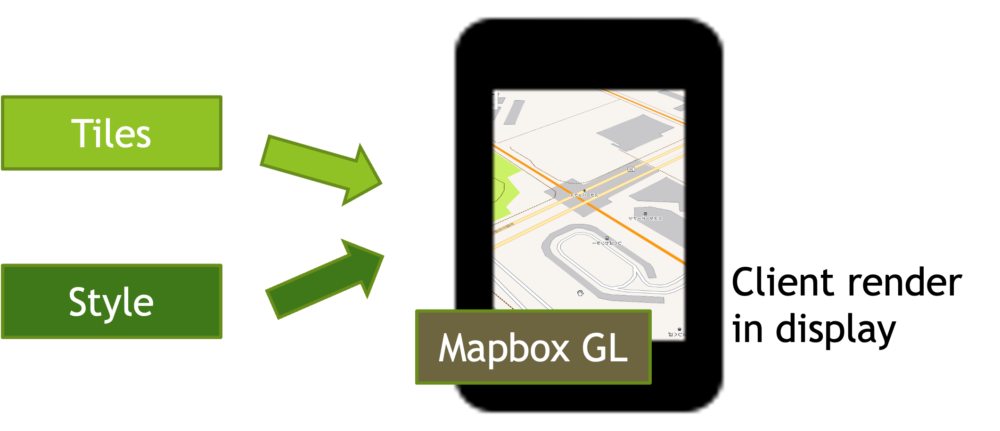

---

# Note: Mapbox GL is proprietary software

- Mapbox GL became proprietary software at the end of 2020.
  - Mapbox GL JS was open-source software up to v1.13.
  - Mapbox GL JS v2 and later require a Mapbox access token.
- The MapLibre GL ecosystem is a fork of the open-source versions of Mapbox GL.
  - https://maplibre.org/
  - We highly recommend using MapLibre GL JS now.

---

# Tile support libraries - JavaScript (1)

- Leaflet
  - https://leafletjs.com/
  - Lightweight and easy to use.
  - Supports Mapbox Vector Tile with a plugin.
- OpenLayers
  - https://openlayers.org/
  - Difficult to use but powerful.
  - Supports Mapbox Vector Tile.

---

# Tile support libraries - JavaScript (2)

- MapLibre GL JS
  - https://maplibre.org/
  - Easy to use for Mapbox Vector Tile.
  - Supports raster xyz tile too.

---

# Tile support libraries - Android

- MapLibre GL Native
  - https://maplibre.org/
  - Easy to use for Mapbox Vector Tile.
  - Supports raster xyz tile too.
- Google Maps SDK
  - https://developers.google.com/maps/documentation/android-sdk/overview
  - Easy to use for raster xyz tile.

---

# Tile support libraries - iOS

- MapLibre GL Native
  - https://maplibre.org/
  - Easy to use for Mapbox Vector Tile.
  - Supports raster xyz tile too.
- MapKit
  - https://developer.apple.com/documentation/mapkit
  - Easy to use for raster xyz tile.

---

# Desktop application

- QGIS
  - https://qgis.org/
  - Supports raster xyz tile.
  - Supports Mapbox Vector Tile.

---

# Software and data used in this presentation

---

# Requirements

- This presentation requires a Linux-based OS.
- You can also use a Raspberry Pi 4.
  - Raspberry Pi 4 is cheap and powerful.
  - Raspberry Pi 4 uses the ARM64/aarch64 architecture.
  - Raspberry Pi 4 is easy to use for GIS.
- My repository for this presentation supports only the ARM64/aarch64 architecture.

---

# Software - GDAL/OGR

- https://gdal.org/
- GDAL/OGR is the most popular GIS library and provides command-line tools.
  - QGIS is built on GDAL/OGR.
- GDAL/OGR supports many GIS data formats.
- GDAL/OGR supports raster XYZ tiles.

---

# Note: GDAL interface changes

- GDAL 3.11 and later use the `gdal` command instead of `gdalinfo`, `gdal_translate`, `ogr2ogr`, etc.
  - The old commands are still available.
- This presentation uses GDAL 3.10, so we use the old commands.

---

# Software - Tippecanoe

- https://github.com/felt/tippecanoe/
- Builds vector tilesets from large (or small) collections of GeoJSON, FlatGeobuf, or CSV features.
- Tippecanoe is the most popular vector tile builder.

---

# Software - Charites

- A command-line tool for writing Mapbox/MapLibre Style Specification in YAML.
  - Developed by the United Nations Vector Tile Toolkit (UNVT).
- Charites converts between the Style Specification (JSON) and YAML.
  - YAML is easy for humans to read and write.
  - YAML is easy for beginners to edit.
- Charites can serve styles dynamically for live preview.


---

# Software - editor

- `nano` is a simple text editor.
  - nano is easy to use for beginners.
- `vim` is a powerful text editor.
  - vim is difficult to use for beginners.
  - vim is easy to use for experts.

---

# Software - make

- make is a build automation tool.
- make is easy to use for both beginners and experts.
- make is a standard tool of UNIX and Linux.
  - This presentation uses make to build and deploy.

---

# Software - caddy

- caddy is a web server.
- caddy is easy to use for beginners.
  - This presentation uses caddy to serve tiles.

---

# Software - tileserver-gl-light

- tileserver-gl-light is a vector tile server.
- Useful for inspecting vector tiles.


---

# Data - Global Map

- Digital geographic information
  - Provided by the International Steering Committee for Global Mapping (ISCGM).
  - Composed of 8 datasets
    - Vector data (Transportation, Boundaries, Drainage, Population Centres)
    - Raster data (Elevation, Vegetation, Land Cover, Land Use)
- Free for non-commercial use.

---

# Global Map - Archive

- GSI moved the archives and website to GitHub.
  - https://github.com/globalmaps
  - https://globalmaps.github.io/
- The old website has been closed.
- Some countries provide Global Map archives on their national sites.
  - All links: https://github.com/globalmaps/projectmanagement/blob/master/REPOS.md
- Some links are dead now.

---

# Global Map – Format

- Vector data is provided as Shapefiles.
  - Originally provided in Geography Markup Language (GML) format.
- Raster data is provided as GeoTIFF files.
  - Originally provided in Band Interleaved by Line (BIL) format.

---

# Data – Aerial photographs

- https://www.mlit.go.jp/plateau/
- In Japan, Project PLATEAU has released a large amount of aerial photograph data.
  - PLATEAU has released point clouds, 3D data, and aerial photographs.
  - Aerial photographs are released as GeoTIFF data.
    - They are good samples for creating raster tiles.

---

# Data - OpenStreetMap

- https://www.openstreetmap.org/
- OpenStreetMap is the most popular open data project.
  - OpenStreetMap provides planet data in PBF format.
- Today's presentation uses OpenStreetMap data as sample data.
  - We use data for a small area to keep it simple.

---

# Data for this presentation

- Global Map Sri Lanka 1.0
  - https://github.com/globalmaps/gmlk10
- Global Map Sri Lanka 2.0
  - https://github.com/globalmaps/gmlk20
- PLATEAU GeoTIFF of Higashimurayama City, Tokyo
  - https://www.geospatial.jp/ckan/dataset/plateau-13213-higashimurayama-shi-2020
- OpenStreetMap data
  - https://tile.openstreetmap.jp/static/planet.pmtiles


---

# How to create your own tiled map

---

# Raster tile processing pattern 1: Global Map (one GeoTIFF file)

- Download a GeoTIFF file from the Global Map archive.
- Enable transparency.
- Convert the GeoTIFF to XYZ tiles using gdal2tiles.

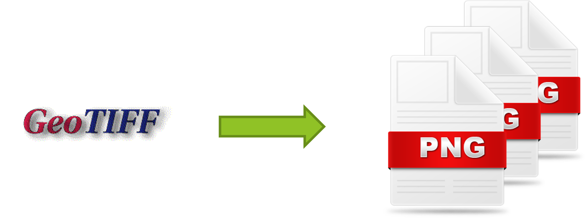

---

# How to process

```bash
cd ~/jica_scripts/raster_tile_gm
make fetch # Download a GeoTIFF file from the Global Map archive.
make transparent # Enable transparency.
make generate_tile # Convert the GeoTIFF to XYZ tiles using gdal2tiles.
make deploy # Copy to the caddy server directory.
```

---

# How to read Makefile (1)

```Makefile
fetch:
        git clone https://github.com/globalmaps/gmlk10.git

transparent:
        gdalbuildvrt -srcnodata "0 0 99" el.vrt gmlk10/el.tif

generate_tile:
        gdal_translate -of vrt -expand rgba el.vrt temp.vrt
        gdal2tiles.py --xyz -s EPSG:4326 -z 0-11 temp.vrt

deploy:
       sudo cp -r temp/ /opt/niroku/data/gmlk10/
```

---

# How to read Makefile (2)

A Makefile makes it simple to run tasks.

```Makefile
task_name:
        command
        command ...
```

---

# Result

Open http://<your ip>/gmlk10/leaflet.html

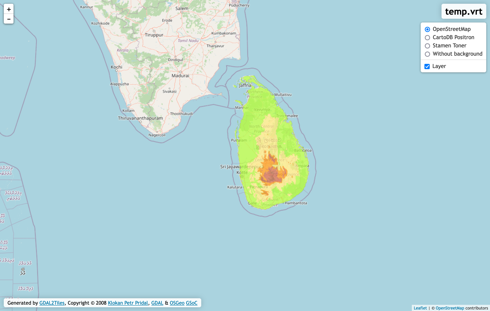

---

# Raster tile processing pattern 2: PLATEAU (many GeoTIFF files)

- Generate a VRT file from the GeoTIFF files.
- Convert the VRT file to XYZ tiles using gdal2tiles.

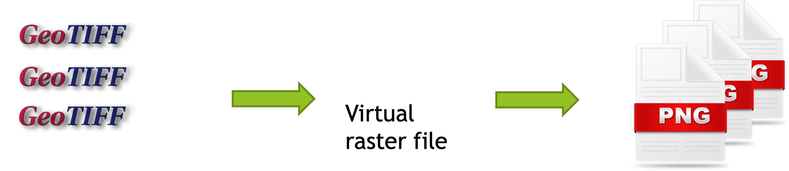

---

# How to process

```bash
cd ~/jica_scripts/raster_tile_plateau
make fetch # Download GeoTIFF files from the PLATEAU archive and extract them.
make buildvrt # Generate a VRT file from the GeoTIFF files.
make generate_tile # Convert the VRT file to XYZ tiles using gdal2tiles.
make deploy # Copy to the caddy server directory.
```

---

# Result

Open http://<your ip>/plateau/leaflet.html

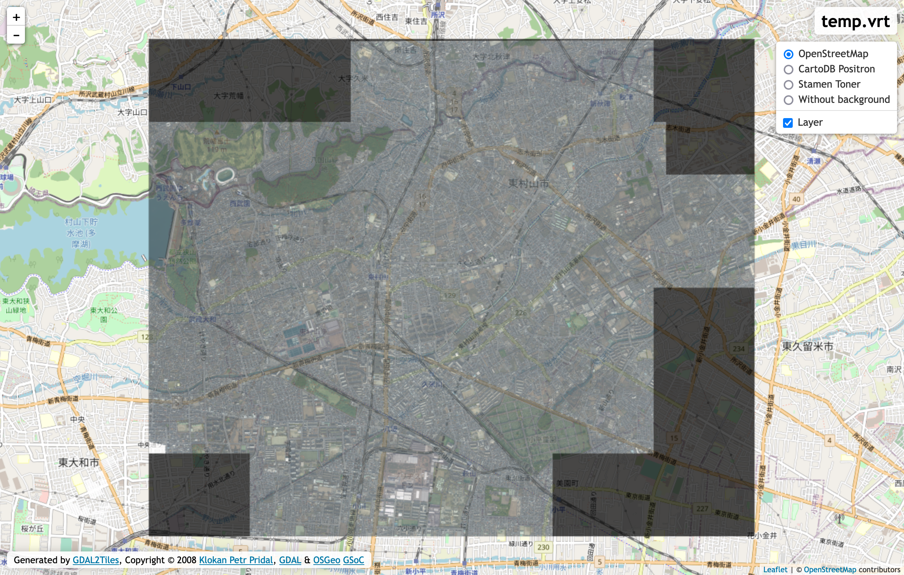

---

# Vector tile processing pattern: Global Map

- Download Shapefiles from the Global Map archive.
- Convert the Shapefiles to GeoJSON using ogr2ogr.
- Convert the GeoJSON to Mapbox Vector Tiles using tippecanoe.

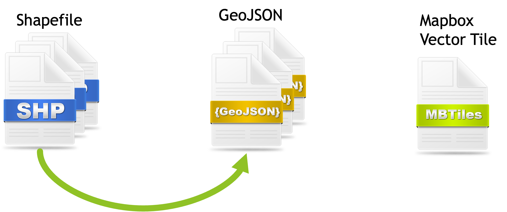

---

# How to process

```bash
cd ~/jica_scripts/vector_tile
make fetch # Download Shapefiles from the Global Map archive.
make convert # Convert the Shapefiles to GeoJSON using ogr2ogr.
make generate # Convert the GeoJSON to Mapbox Vector Tiles using tippecanoe.
make tileserver-gl # Run tileserver-gl-light.
```

---

# Result

Open http://<your ip>:8000/

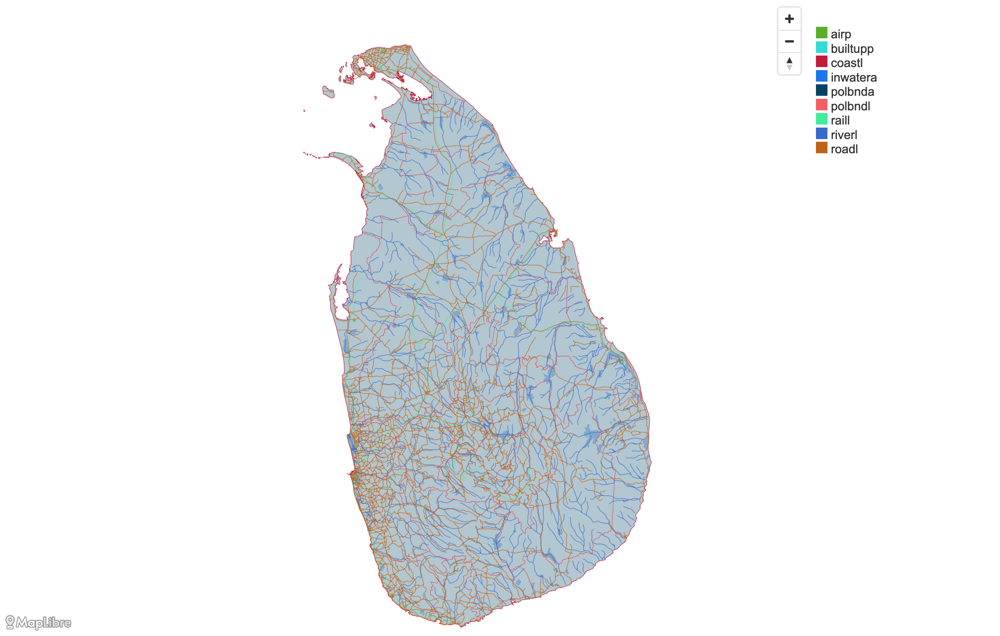

---

# Makefile (1/3)

```Makefile
fetch:
	git clone https://github.com/globalmaps/gmlk20.git

convert:
	cd gmlk20; \
	ogr2ogr airp_lka.geojson -s_srs EPSG:4326 -t_srs EPSG:4326 airp_lka.shp; \
	ogr2ogr builtupp_lka.geojson -s_srs EPSG:4326 -t_srs EPSG:4326 builtupp_lka.shp; \
	ogr2ogr coastl_lka.geojson -s_srs EPSG:4326 -t_srs EPSG:4326 coastl_lka.shp; \
	ogr2ogr inwatera_lka.geojson -s_srs EPSG:4326 -t_srs EPSG:4326 inwatera_lka.shp; \
	ogr2ogr polbnda_lka.geojson -s_srs EPSG:4326 -t_srs EPSG:4326 polbnda_lka.shp; \
	ogr2ogr polbndl_lka.geojson -s_srs EPSG:4326 -t_srs EPSG:4326 polbndl_lka.shp; \
	ogr2ogr raill_lka.geojson -s_srs EPSG:4326 -t_srs EPSG:4326 raill_lka.shp; \
	ogr2ogr riverl_lka.geojson -s_srs EPSG:4326 -t_srs EPSG:4326 riverl_lka.shp; \
	ogr2ogr roadl_lka.geojson -s_srs EPSG:4326 -t_srs EPSG:4326 roadl_lka.shp
```

---

# 9 outputs

- ogr2ogr converts the Shapefiles to GeoJSON.
  - Note: These Shapefiles don't include a .prj file, so the SRS is specified explicitly.

---

# Makefile (2/3)

```
generate:
	tippecanoe -o lka.pmtiles \
	  -L airp:gmlk20/airp_lka.geojson \
	  -L builtupp:gmlk20/builtupp_lka.geojson \
	  -L coastl:gmlk20/coastl_lka.geojson \
	  -L inwatera:gmlk20/inwatera_lka.geojson \
	  -L polbnda:gmlk20/polbnda_lka.geojson \
	  -L polbndl:gmlk20/polbndl_lka.geojson \
	  -L raill:gmlk20/raill_lka.geojson \
	  -L riverl:gmlk20/riverl_lka.geojson \
	  -L roadl:gmlk20/roadl_lka.geojson
	tippecanoe -o lka.mbtiles \
	  -L airp:gmlk20/airp_lka.geojson \
	  -L builtupp:gmlk20/builtupp_lka.geojson \
	  -L coastl:gmlk20/coastl_lka.geojson \
	  -L inwatera:gmlk20/inwatera_lka.geojson \
	  -L polbnda:gmlk20/polbnda_lka.geojson \
	  -L polbndl:gmlk20/polbndl_lka.geojson \
	  -L raill:gmlk20/raill_lka.geojson \
	  -L riverl:gmlk20/riverl_lka.geojson \
	  -L roadl:gmlk20/roadl_lka.geojson
```

---

# 2 outputs

- tippecanoe runs twice and generates 2 outputs.
  - .mbtiles file
    - An SQLite database file.
    - Contains vector tiles.
  - .pmtiles file
    - A "Cloud Native" format.
    - You can host .pmtiles as a static file.

---

# MBTiles - SQLite database

- MBTiles is a container for tiles.
  - MBTiles is a single-file database (SQLite).
  - Uses the TMS scheme.

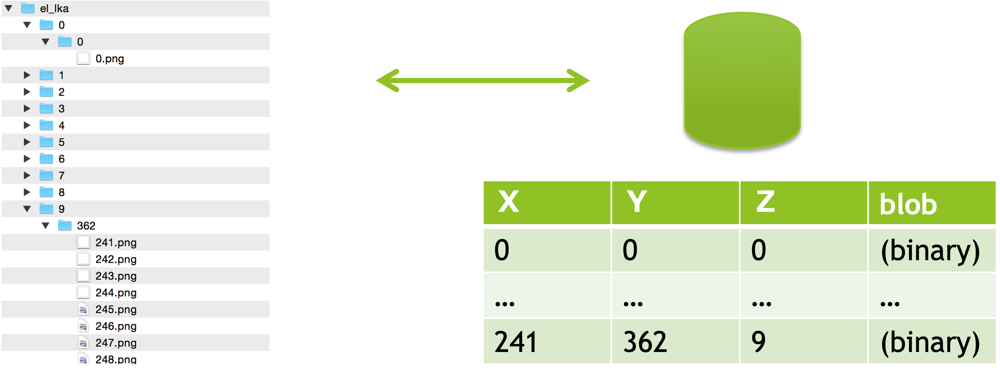

---

# Makefile (3/3)

```Makefile
tileserver-gl:
	tileserver-gl-light --port 8000 --bind 0.0.0.0 --file lka.mbtiles
```

---

# PMTiles - Cloud Native format

- PMTiles is similar to MBTiles.
  - A "Cloud Native" format.
  - You can easily convert MBTiles to PMTiles using the `pmtiles` command.

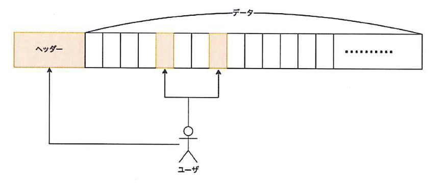

https://smellman.github.io/pmtiles-example/

---

# How to design your own tiled map

---

# Designing a tiled map

- Vector tiles don't have a style.
  - The client renders images based on style settings.
- In this presentation, we use `charites` to design a tiled map.
  - Charites converts between the Style Specification (JSON) and YAML.
  - YAML is easy for humans to read and write.
  - YAML is easy for beginners to edit.

---

# Try editing the style

```bash
cd ~/jica_scripts/vector_tile
sudo make practice
```
Open http://<your ip>:8000/ in your browser.

Open another terminal and run the following commands.

```bash
cd ~/jica_scripts/vector_tile
nano style-practice.yml
```

---

# nano

- nano is a simple text editor.
  - nano is easy to use for beginners.
- Ctrl + O: Save the file
- Ctrl + X: Exit nano

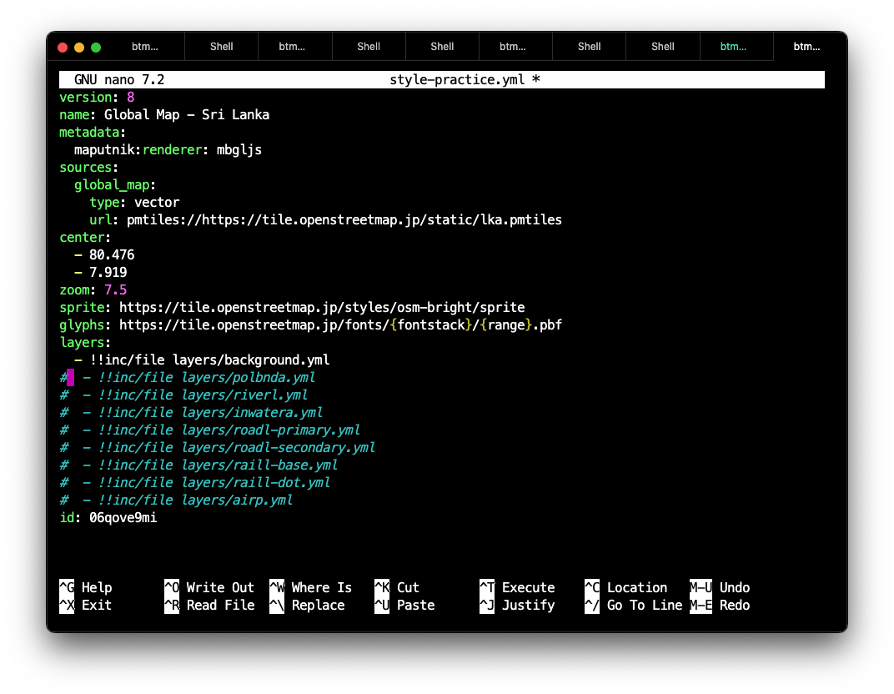

---

# Uncomment the layers

Remove the `#` comment markers in style-practice.yml.

```yaml
layers:
  - !!inc/file layers/background.yml
#  - !!inc/file layers/polbnda.yml
#  - !!inc/file layers/riverl.yml
#  - !!inc/file layers/inwatera.yml
#  - !!inc/file layers/roadl-primary.yml
#  - !!inc/file layers/roadl-secondary.yml
#  - !!inc/file layers/raill-base.yml
#  - !!inc/file layers/raill-dot.yml
#  - !!inc/file layers/airp.yml
```

---

# Layers in the MapLibre Style Specification

- Background
- Fill
- Line
- Symbol
- Circle
- Raster
- Hillshade
- Fill Extrusion
  - Used for 3D rendering.

https://maplibre.org/maplibre-style-spec/

---

# Background layer

```yaml
id: background
type: background
paint: 
  background-color: rgb(0,0,0)
```

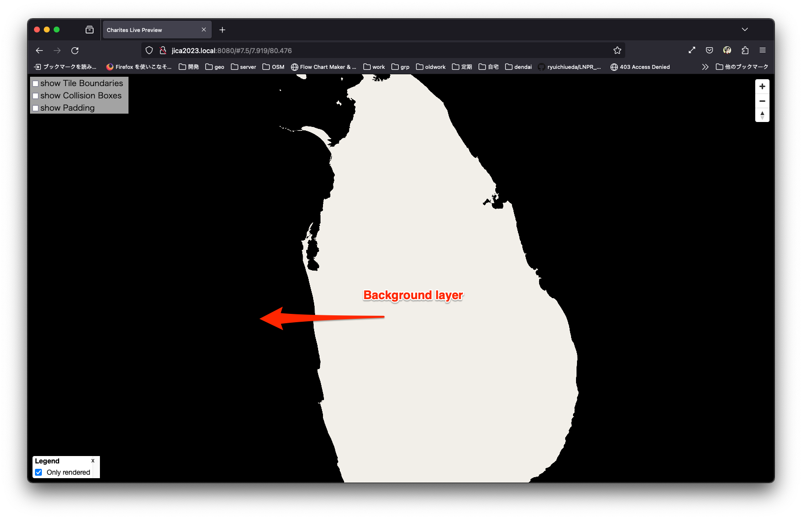

---

# Fill layer

```yaml
id: polbnda
type: fill
source: global_map
source-layer: polbnda
paint:
  fill-color: '#f2efe9'
```

- `source: global_map` refers to the "global_map" source in the sources section.
- `source-layer: polbnda` refers to the "polbnda" layer in the global_map source.

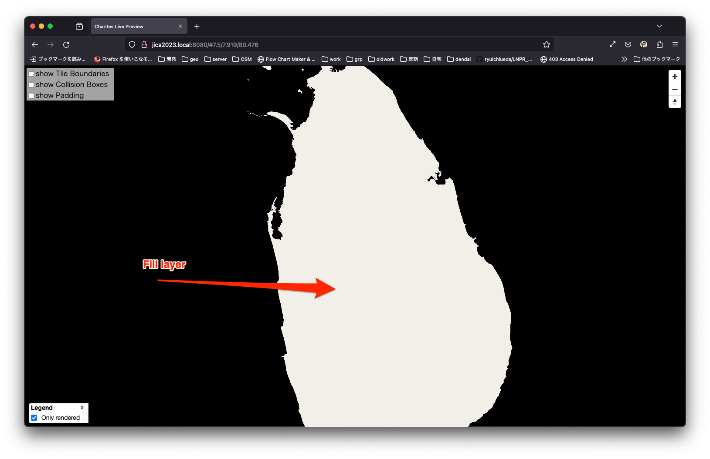

---

# Line layer

```yaml
id: riverl
type: line
source: global_map
source-layer: riverl
paint:
  line-color: rgb(0,0,255)
  line-width:
    base: 1
    stops:
      - - 6
        - 0.5
      - - 10
        - 2
```

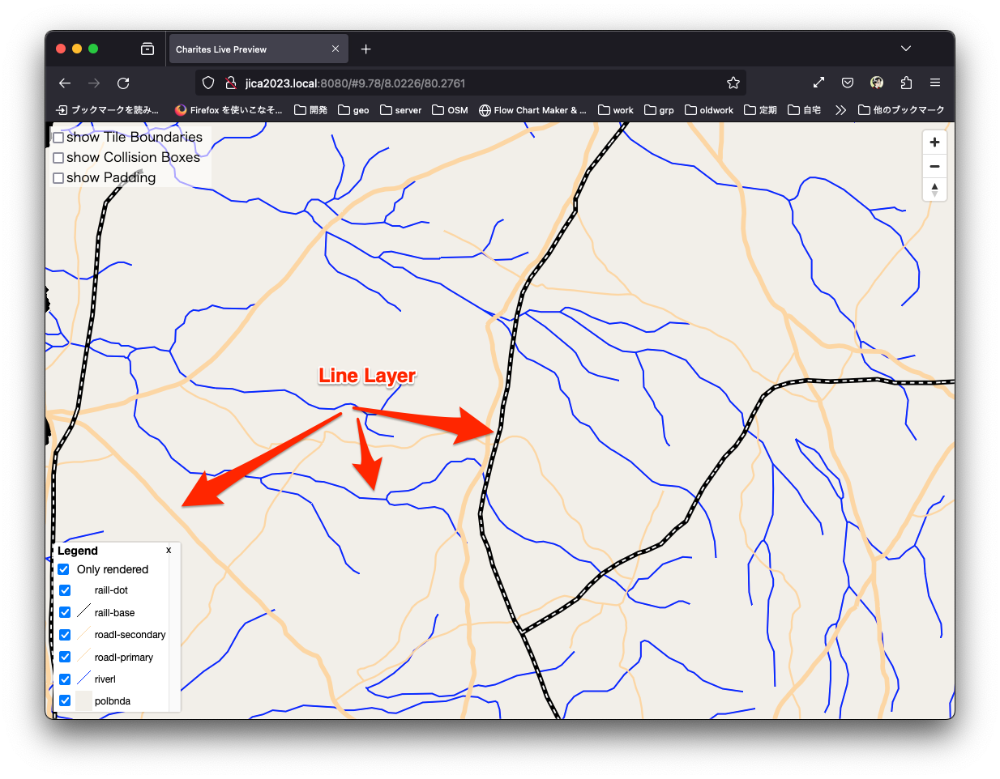

---

# Line layer

- Draws lines from polyline features.
  - Solid lines
  - Dashed lines (line-dasharray)
    - The following example combines a solid line and a dashed line.
  
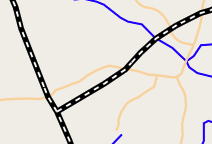

---

# Filter

roadl-primary.yml and roadl-secondary.yml use filters.

roadl-primary.yml uses the following filter.

```yaml
filter:
  - all
  - - '=='
    - rtt
    - '14'
```

'rtt' is a field name in the roadl layer, and '14' means a primary route.

---

# Zoom function

- Zoom functions are useful for changing the style by zoom level.
  - If you set 1 at zoom 6 and 6 at zoom 10, the value increases between zoom 6 and 10.
- The "base" property controls the rate at which the function output increases.
  - With "base = 1", the value increases linearly.

https://maplibre.org/maplibre-style-spec/expressions/

---

# Symbol layer

```yaml
id: airp
type: symbol
source: global_map
source-layer: airp
layout:
  icon-image: airport_11
  text-field: '{nam}'
  text-offset:
    - 0
    - 0.6
```

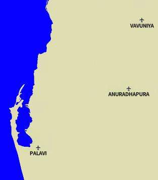

---

# Symbol layer

- Draws symbols for features.
  - Icon
  - Text
  - Text with icon
- Supports point, polygon, and polyline features.

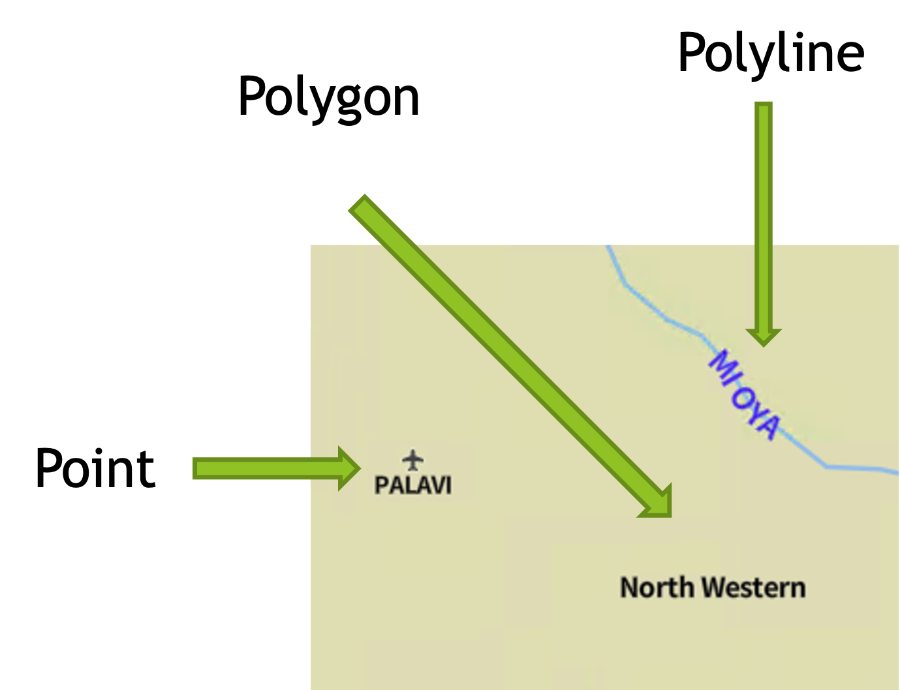

---

# icon-image and text-field

- icon-image is a property of the symbol layer.
  - icon-image is the name of an icon.
    - Icons are defined in the sprite.
- text-field is a property of the symbol layer.
  - text-field specifies the text to display.
    - You can reference feature properties with {field_name}.

---

# text-offset

- text-offset is a property of the symbol layer.
  - text-offset is the offset of the text.
    - It takes an array of [x, y].
    - x and y are offsets from the center of the point.

```yaml
layout:
  icon-image: airport_11
  text-field: '{nam}'
  text-offset:
    - 0
    - 0.6
```

---

# Convert your style with charites

Stop the `make practice` command and run the following command.

```bash
make build
```

The `Makefile` makes it simple to run tasks.

```Makefile
build:
  charites convert style-practice.yml style-practice.json
```

---

# Result

```bash
make deploy
```

Open http://<your ip>/vector/ in your browser.

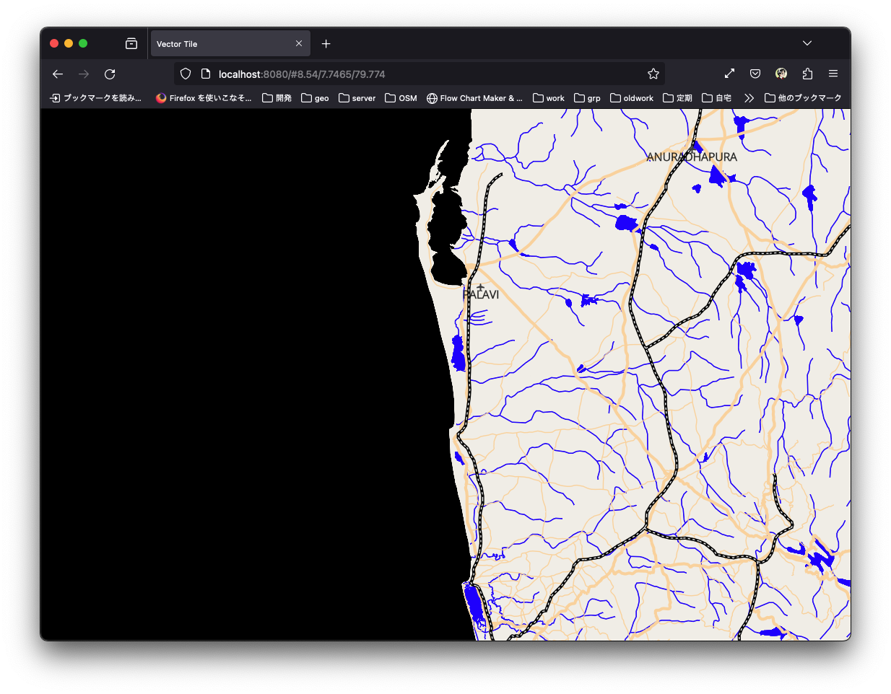

--- 

# How to distribute your own tiled map

---

# Raster tile hosting (1)

- If you have only a small amount of data, hosting tiles as static images is easy.
  - Use nginx or Apache HTTP Server.
  - Use AWS S3 or Google Cloud Storage.
  - GitHub Pages is free and good for small data.
    - Be careful about the license of the tile images.

https://docs.github.com/en/pages/getting-started-with-github-pages/about-github-pages

---

# Raster tile hosting (2)

- If you have a large amount of data, be careful when hosting it.
  - File system limitation: maximum number of files.
    - ext4 on Linux: up to 4,294,967,295 files (set when the file system is created)
  - Copying files takes a long time.
  - MBTiles is a solution for hosting large amounts of data.
    - MBUtil is useful for creating .mbtiles from tile images.

```bash
mb-util temp/ el.mbtiles 
```

---

# Vector tile hosting - tileserver-gl

- TileServer GL is useful.
  - However, vector tiles need HTTPS (SSL) access on the Internet.
  - Let's Encrypt is useful for getting an SSL certificate.
    - https://letsencrypt.org/
  - Set up a frontend server (Apache, nginx, etc.) and connect it to TileServer GL with a reverse proxy.

---

# Overview - nginx

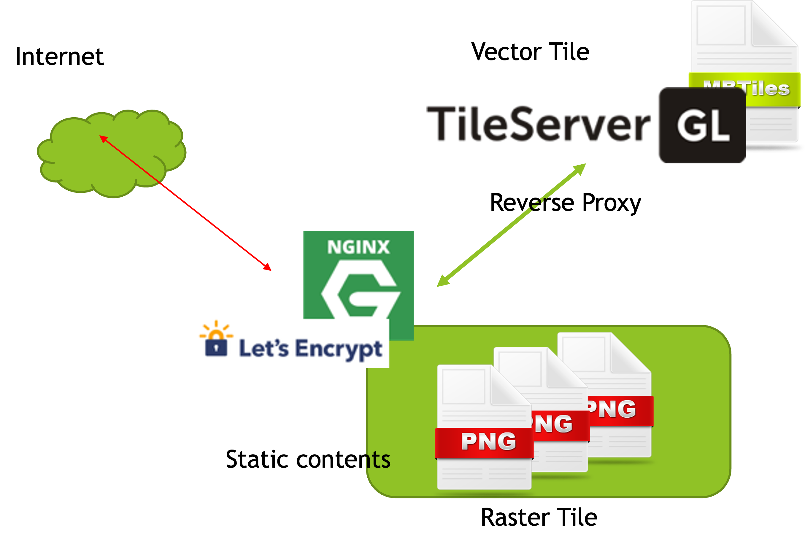

--- 

# Reverse proxy setting

- It is easy to set up a reverse proxy with nginx.

```nginx
location / {
    proxy_set_header X-Forwarded-Proto https;
    proxy_set_header X-Forwarded-For $proxy_add_x_forwarded_for;
    proxy_set_header Host $http_host;
    proxy_pass http://localhost:8080;
}
```

---

# Server-side rendering

- TileServer GL can deliver raster tiles if you host a style.
  - However, rendering is slow.
    - If you use this feature, you should use a cache server.

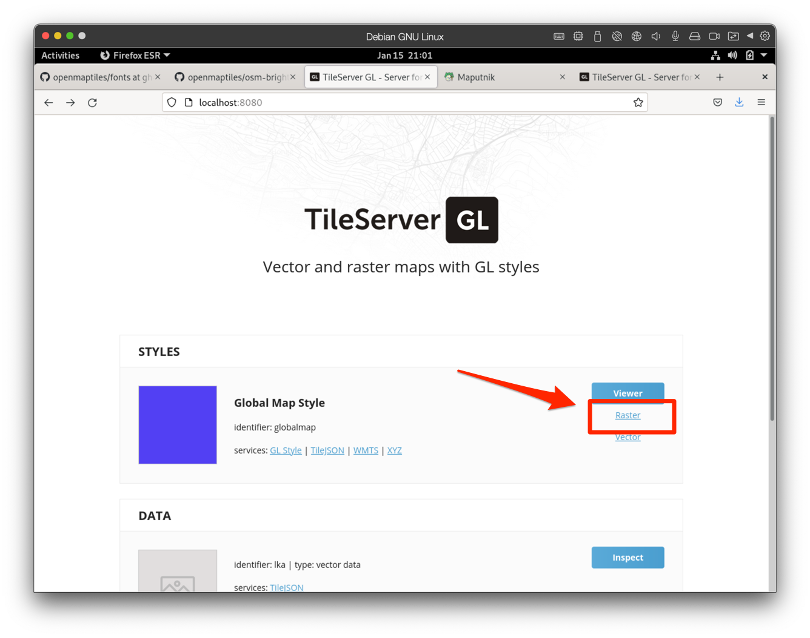

---

# TileServer GL - Cache

- Use Varnish Cache for raster rendering.
  - https://varnish-cache.org/
- https://tile.openstreetmap.jp/ uses Varnish Cache.
  - Runs 20 processes.
  - 20-core CPU and 64 GB RAM.

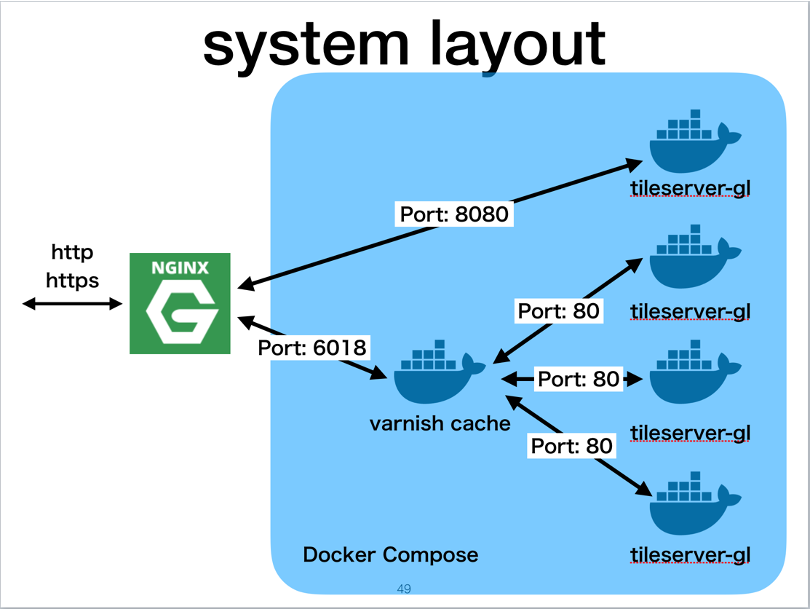

---

# Vector tile hosting - pmtiles

- PMTiles is useful for hosting vector tiles.
  - PMTiles is a "Cloud Native" format.
  - PMTiles is easy to host as a static file.
    - nginx / Apache / AWS S3 / Google Cloud Storage, etc.

https://github.com/protomaps/PMTiles

---

# PMTiles nginx setting - CORS setting

```nginx
add_header 'Access-Control-Allow-Origin' "$http_origin" always;
add_header 'Access-Control-Allow-Credentials' 'true' always;
add_header 'Access-Control-Allow-Methods' 'GET, POST, PUT, DELETE, OPTIONS' always;
add_header 'Access-Control-Allow-Headers' 'Accept,Authorization,Cache-Control,Content-Type,DNT,If-Modified-Since,Keep-Alive,Origin,Range,User-Agent,X-Requested-With' always;

if ($request_method = 'OPTIONS') {
  # Tell client that this pre-flight info is valid for 20 days
  add_header 'Access-Control-Allow-Origin' "$http_origin" always;
  add_header 'Access-Control-Allow-Headers' 'Accept,Authorization,Cache-Control,Content-Type,DNT,If-Modified-Since,Keep-Alive,Origin,Range,User-Agent,X-Requested-With' always;
  add_header 'Access-Control-Max-Age' 1728000;
  add_header 'Content-Type' 'text/plain charset=UTF-8';
  add_header 'Content-Length' 0;
  return 204;
}
```

See: https://github.com/smellman/pmtiles-example

---

# Copyright

- This presentation is licensed under [CC BY 4.0](https://creativecommons.org/licenses/by/4.0/).
- All images containing OpenStreetMap data are licensed under [CC BY-SA 2.0](https://creativecommons.org/licenses/by-sa/2.0/).
  - © OpenStreetMap contributors
